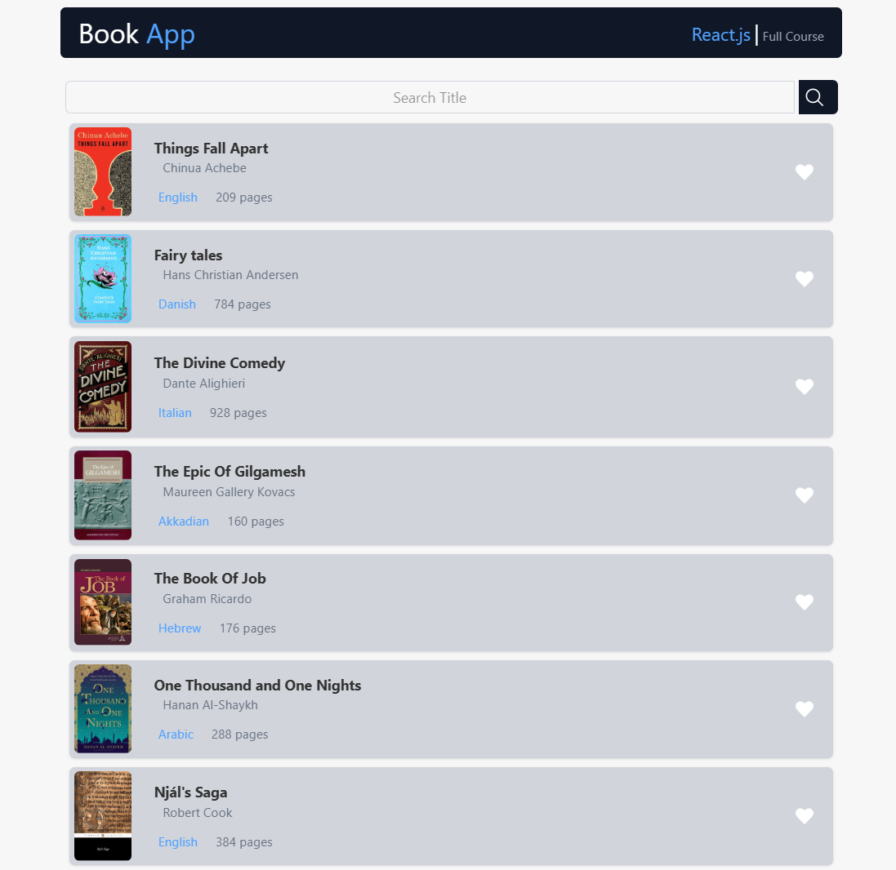

### وبسایت Book App

این **ویبسایت Book App** به عنوان پروژه‌ای آموزشی ساخته شده است. هدف این وبسایت، آموزش و یادگیری در مورد توسعه وب با استفاده از **ReactJS** بوده و برای تست و آزمایش ایجاد شده است. این وبسایت تنها برای اهداف آموزشی و یادگیری طراحی شده و امکانات ساده‌ای دارد.

ویژگی‌ها:

- **جستجوی کتاب‌ها**: می‌توانید به راحتی در عنوان کتاب‌ها جستجو کنید.
- **لایک کردن کتاب‌ها**: امکان لایک کردن کتاب‌ها برای ذخیره کتاب‌های مورد علاقه شما وجود دارد.
- **مشاهده کتاب‌ها**: می‌توانید کتاب‌هایی که دوست دارید را مشاهده و مرور کنید.

این وبسایت به‌صورت ساده طراحی شده و به شما این امکان را می‌دهد که با قابلیت‌های اولیه **ReactJS** آشنا شوید و تجربه‌ای از یک پروژه عملی به‌دست آورید.

این پروژه برای اهداف آموزشی طراحی شده است و تنها به عنوان یک وبسایت تستی برای یادگیری بیشتر از آن استفاده می‌شود.

در زیر پیش‌نمایشی از طراحی و رابط کاربری وبسایت آمده است:

شما همچنین می‌توانید برای دریافت به‌روزرسانی‌های بیشتر، مرا در شبکه‌های اجتماعی دنبال کنید:

- [اینستاگرام](https://www.instagram.com/matinhasanpour_)
- [تلگرام](https://t.me/mattinhasanpour)
