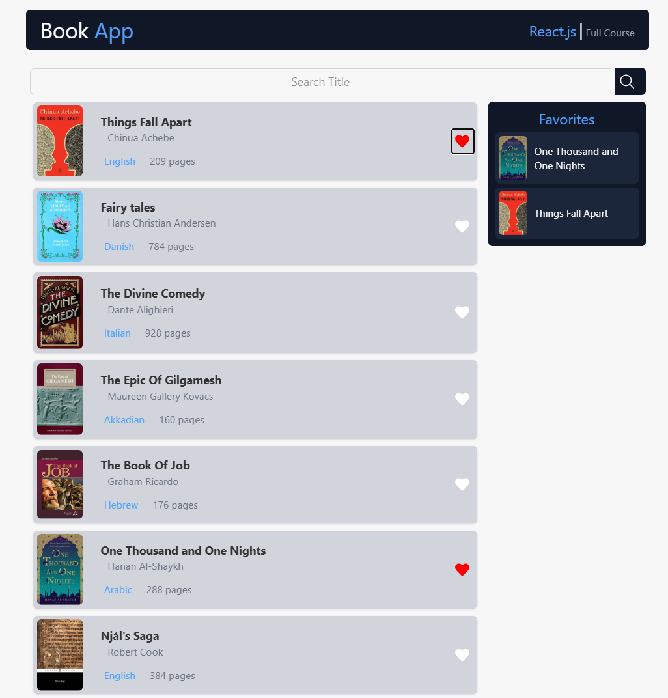

### Book App Website

This **Book App** website has been created as an educational project. The purpose of this website is to learn and practice web development using **ReactJS**. It is created for testing and experimenting with ReactJS features. This website is purely for educational purposes and is designed as a test project.

Features:

- **Book Search**: Easily search for books by their titles.
- **Liking Books**: You can like books to save your favorite ones.
- **Book View**: You can view and browse books that interest you.

This website is designed in a simple way to give you an experience with basic **ReactJS** functionality. It provides a hands-on project to help you get familiar with web development.

This project is created for educational purposes and serves as a test website to learn more about ReactJS and web development.

Below is a preview of the design and user interface of the website:

You can also follow me on my social media accounts for more updates:

- [Instagram](https://www.instagram.com/matinhasanpour_)
- [Telegram](https://t.me/mattinhasanpour)

---
